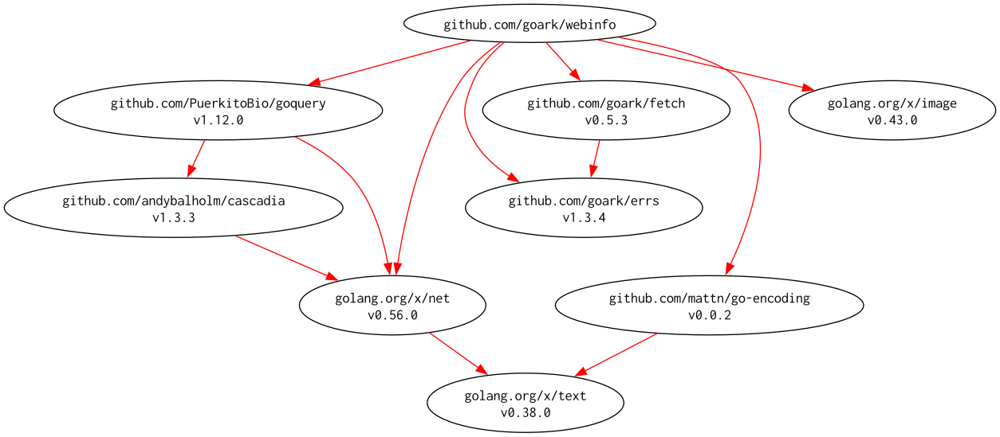

# [webinfo] -- Extract metadata and structured information from web pages

[](https://github.com/goark/webinfo/actions)
[](https://raw.githubusercontent.com/goark/webinfo/master/LICENSE)
[](https://github.com/goark/webinfo/releases/latest)

[`webinfo`][webinfo] is a small Go module that extracts common metadata from web pages and provides utilities
to download representative images and create thumbnails.

## Quick overview

- **Package**: `webinfo`
- **Repository**: `github.com/goark/webinfo`
- **Purpose**: fetch page metadata (title, description, canonical, image, etc.) and download images

## Features

- Fetch page metadata with `Fetch` (handles encodings and meta tag precedence).
- Download an image referenced by `Webinfo.ImageURL` using `(*Webinfo).DownloadImage`.
- Create a thumbnail from the referenced image using `(*Webinfo).DownloadThumbnail`.

## Install

Use Go modules (Go 1.25+ as used by the project):

```bash
go get github.com/goark/webinfo@latest
```

## Basic usage

Example showing fetch and download thumbnail (error handling omitted for brevity):

```go
package main

import (
    "context"
    "fmt"
    "github.com/goark/webinfo"
)

func main() {
    ctx := context.Background()
    // Fetch metadata for a page (empty UA uses default)
    info, err := webinfo.Fetch(ctx, "https://example.com", "")
    if err != nil {
        fmt.Fprintln(os.Stderr, "error fetching webinfo:", err)
        return
    }

    // Download thumbnail: width 150, to directory "thumbnails", permanent file
    thumbPath, err := info.DownloadThumbnail(ctx, "thumbnails", 150, false)
    if err != nil {
        fmt.Fprintln(os.Stderr, "error downloading thumbnail:", err)
        return
    }
    fmt.Println("thumbnail saved:", thumbPath)
}
```

### API notes

- `Fetch(ctx, url, userAgent)` — Parse and extract metadata. Pass an empty userAgent to use the module default.
- `(*Webinfo).DownloadImage(ctx, destDir, temporary)` — Download the image in `Webinfo.ImageURL` and save it. If
  `temporary` is true (or `destDir` is empty), a temporary file is created.
- `(*Webinfo).DownloadThumbnail(ctx, destDir, width, temporary)` — Download the referenced image and produce a
  thumbnail resized to `width` pixels (height is preserved by aspect ratio). If `destDir` is empty the method
  creates a temporary file; when `temporary` is false the thumbnail file is named based on the original image
  name with `-thums` appended before the extension.

### Error handling

The package uses `github.com/goark/errs` for wrapping errors with contextual keys (e.g. `url`, `path`, `dir`).
Callers should inspect returned errors accordingly.

### Tests & development

- Run all tests: `go test ./...`
- The repository includes `Taskfile.yml` tasks for common workflows; see that file for CI/test commands.

## Modules Requirement Graph

[](./dependency.png)

[webinfo]: https://github.com/goark/webinfo "goark/webinfo: Extract metadata and structured information from web pages"
